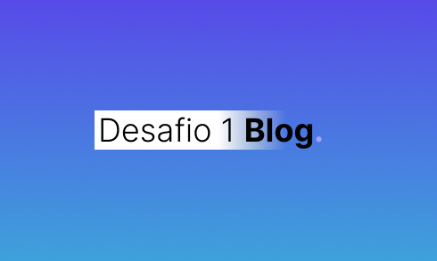

# desafio1-blog

  

### 🚀 Technologies
- HTML5
- SASS
- JavaScript

  - Local Starage
  - JSON
  - RegExp

### 💻 Project
Codelândia: Your personal blog! Publish your articles with us. By clicking on the highlighted button, a modal will appear where you can enter the title and content of the post, make sure the fields are filled in! By pressing enter you will have your post published, easy right 😇? You can also bookmark your favorite posts. Good articles for you!

Here is the deploy [link](https://desafio1-blog.vercel.app/).

### 🔖 Layout
Here is the design [link](https://www.figma.com/file/Yb9IBH56g7T1hdIyZ3BMNO/Desafios---Codel%C3%A2ndia?node-id=139%3A51) for that project.

### 📝 License
This project is under the MIT license. See the [file](LICENSE) for more details.

### 👍 Assignments
- Favicon: <a href="https://www.flaticon.com/br/icones-gratis/blog" title="blog ícones">Blog ícones criados por Freepik - Flaticon</a>
